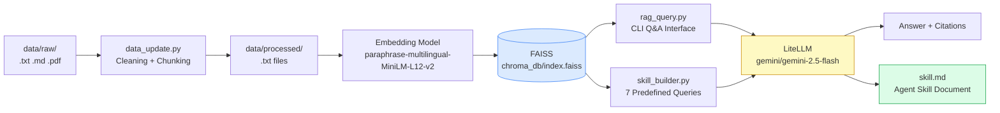

# HW3 — Personal Knowledge RAG: AI Technology Rapid Evolution

A local Retrieval-Augmented Generation (RAG) pipeline for grounded Q&A and automated skill document generation, focused on the theme of **AI technology rapid evolution, knowledge anxiety, and adaptation pressure**.

- **Python version used**: 3.11.9 (requires >= 3.10)
- **No Docker required** — uses FAISS as a local, file-based vector store

---

## 1. Project Overview

### Knowledge Domain

This system is built around the theme of **AI technology rapid evolution and knowledge anxiety**. The knowledge base consists of 28 curated documents covering the following areas:

- LLM model evolution pace (GPT, Gemma, DeepSeek, Reasoning Models)
- AI tooling ecosystem (LangChain, LiteLLM, HuggingFace, MCP)
- Knowledge management and adaptation pressure (knowledge anxiety, adaptation pressure)
- Vector database and RAG technology (ChromaDB, FAISS, pgvector comparison)
- Embedding models and fine-tuning methods (sentence-transformers, fine-tuning)

Source types include: official technical blogs, academic reports (Stanford HAI AI Index), open-source project documentation, tech media articles (iThome), and model cards. Time range: 2024–2026.

### System Architecture

Three CLI tools share a common `rag_core.py` module:

- **`data_update.py`** — Data pipeline: cleaning, chunking, embedding, and indexing
- **`rag_query.py`** — RAG Q&A CLI (single-query and interactive multi-turn modes)
- **`skill_builder.py`** — Automatically generates the `skill.md` knowledge document

---

## 2. System Architecture Diagram



---

## 3. Design Decisions

### Chunking Strategy

Documents are split using a **character-based sliding window**:

- Default chunk size: **512 characters**
- Default overlap: **50 characters**
- Each chunk records `char_start` and `char_end` offsets in the source file

**Alternatives evaluated:**
- 256 characters: too granular — individual chunks lack sufficient semantic context, degrading LLM answer quality
- 1024 characters: too coarse — embedding vectors become diluted, reducing similarity search precision
- Paragraph-based splitting: inconsistent document formatting (some files lack clear paragraph boundaries) makes this approach unreliable

**Rationale for 512 characters:** Approximately 100–150 English tokens — sufficient to capture a complete argument or paragraph while keeping the embedding vector semantically focused. A 50-character overlap ensures that concepts spanning chunk boundaries are not silently dropped.

### Embedding Model

Uses `paraphrase-multilingual-MiniLM-L12-v2` (sentence-transformers, local inference):

- **Completely free**: no API key required; the model is downloaded automatically on first run (~420 MB) and runs fully offline thereafter
- **Multilingual**: supports 50+ languages, suitable for mixed Chinese–English content
- **Compact**: 384-dimensional vectors with strong semantic capture at low computational cost
- Outperforms `all-MiniLM-L6-v2` (English-only) on Chinese-language semantic tasks

### Vector Store: FAISS

FAISS (`faiss-cpu`) was chosen over ChromaDB for the following reasons:

- **Encountered in practice**: during early development on Windows 11, ChromaDB raised `RuntimeError: Your system has an unsupported version of sqlite3` — the system sqlite3 version (3.31) was below ChromaDB's minimum requirement (3.35+), with no straightforward upgrade path
- **Alternatives evaluated**: pgvector (requires Docker), Qdrant (requires a running server), FAISS (pure Python, zero dependencies)
- **Why FAISS**: persists to two local files (`index.faiss` + `metadata.json`), requires no server or Docker, and runs stably on any Python 3.10+ environment
- **Technical detail**: uses `IndexFlatIP` (inner product search) with L2 normalization, which is mathematically equivalent to cosine similarity
- **Naming note**: the directory is named `chroma_db/` to maintain compatibility with the original design specification

### Retrieval Strategy

- Default top-k = 5, adjustable via `--top-k`
- Similarity threshold = 0.0 (no filtering; the LLM is instructed to assess relevance from context)
- Reranking not implemented — with 28 documents and 192 chunks, top-5 cosine similarity retrieval is sufficiently precise

### Prompt Engineering

The system prompt is designed around three principles:

1. Strictly ground answers in the provided context to prevent hallucination
2. Require source citations using `[N]` notation
3. Respond in the same language as the user's question (Chinese/English adaptive)

```python
system_prompt = (
    "You are a knowledgeable AI research assistant. "
    "Answer based ONLY on the provided context. "
    "Cite sources using [N] notation. "
    "If context is insufficient, say so clearly. "
    "Always respond in the same language as the user's question."
)
```

### Idempotency Design

`data_update.py` guarantees idempotent execution through two mechanisms:

1. **MD5 hash manifest**: each indexed `.txt` file's MD5 hash is stored in `manifest.json`; on subsequent runs, unchanged files are skipped
2. **ID-based upsert**: chunk IDs follow the pattern `{filename}_{chunk_index}` (e.g., `rag_survey_2024_2025_0`); the FAISS upsert logic skips any ID that already exists in the store

The `--rebuild` flag clears both the FAISS index and `manifest.json`, guaranteeing a clean rebuild from scratch.

### skill_builder.py Query Design

Seven predefined global queries map to the seven content sections of `skill.md`:

| Section | Query Design Rationale |
|---|---|
| Overview | "What is the overall phenomenon and why does it matter?" → forces a high-level synthesis |
| Core Concepts | "What are the core concepts?" → extracts the knowledge base's terminology system |
| Key Trends | "What are the key trends and their impact?" → captures dynamic change |
| Key Entities | "Who are the key organizations, models, and researchers?" → builds knowledge graph nodes |
| Methodology | "What methodologies help people cope?" → extracts actionable knowledge |
| Knowledge Gaps | "What are the limitations and gaps?" → honestly defines knowledge boundaries |
| Example Q&A | "Give examples of common questions and answers" → demonstrates the Skill's capability range |

---

## 4. Setup and Execution

### 4-1. Python Version and Virtual Environment

```bash
# Step 0: Verify Python version (>= 3.10 required; developed with 3.11.9)
python --version

# Step 1: Create a virtual environment
python -m venv .venv

# Step 2: Activate the virtual environment
# Windows:
.venv\Scripts\activate
# Linux / macOS:
source .venv/bin/activate

# Step 3: Install dependencies
pip install -r requirements.txt
```

> Note: On Ubuntu 22.04+, running `pip install` directly will raise an `externally-managed-environment` error. Always create and activate a virtual environment first.

### 4-2. Vector Store

This system uses **FAISS** (local files). **No Docker or external server is required.**

The `chroma_db/` directory is created automatically on the first run of `data_update.py`.

### 4-3. Full Execution Workflow

```bash
# ① Verify Python version
python --version   # must show >= 3.10.x

# ② Create and activate virtual environment
python -m venv .venv
# Windows: .venv\Scripts\activate
# Linux/macOS: source .venv/bin/activate

# ③ Install dependencies
pip install -r requirements.txt

# ④ Configure environment variables
cp .env.example .env
# Fill in LITELLM_API_KEY and LITELLM_BASE_URL with the values provided by the instructor

# ⑤ Build the full index from scratch
python data_update.py --rebuild

# ⑥ Test RAG Q&A
python rag_query.py --query "What is knowledge anxiety in the context of AI?"

# ⑦ Generate the Skill document
python skill_builder.py --output skill.md

# ⑧ Run RAG Q&A in interactive multi-turn mode
python rag_query.py

# In interactive mode, you will be prompted to enter questions one at a time.
# Type your question and press Enter to receive an answer with cited sources.
# Type 'exit' or 'quit' to end the session.


```

**Reproducibility checklist:**

- [ ] `python data_update.py --help` exits without error
- [ ] `python rag_query.py --help` exits without error
- [ ] `python skill_builder.py --help` exits without error
- [ ] `data/processed/` contains 28 `.txt` files
- [ ] `python data_update.py --rebuild` completes with `Total chunks in store > 0`
- [ ] `python rag_query.py --query "..."` returns an answer with cited sources
- [ ] `skill.md` exists and contains all required sections

---

## 5. Data Sources Statement

| Source | Type | License / Compliance |
|---|---|---|
| Stanford HAI AI Index 2025 | Academic report | Public report, CC BY-ND |
| Google Gemma Official Blog & Model Cards | Official documentation | Apache 2.0 / Public release |
| DeepSeek R1 Technical Report | Technical document | Public release |
| LangChain / LangGraph Official Docs | Open-source documentation | MIT License |
| LiteLLM Official Documentation | Open-source documentation | MIT License |
| HuggingFace Ecosystem Articles | Technical blog | Public release |
| iThome AI Technical Articles | Media articles | Personal educational use |
| MCP Tool Protocol Documentation | Open-source specification | Public release |
| RAG Survey 2024–2025 | Academic abstract | arXiv open access |
| Other LLM Technical Articles | Technical blogs | Public release |

All sources are publicly available and legally compliant. No paywalled content is included.

---

## 6. Limitations and Future Work

### Current Limitations

- **Knowledge cutoff**: data collection ends in April 2026; AI developments after this date are not covered
- **Fixed chunk boundaries**: 512-character chunking may split mid-sentence, occasionally reducing retrieval precision for queries that span chunk boundaries
- **No reranking**: retrieval relies solely on cosine similarity; a cross-encoder reranker would improve precision for complex queries
- **English-dominant corpus**: although a multilingual embedding model is used, the majority of source documents are in English, which may slightly reduce retrieval quality for Chinese-language queries

### Future Improvements

- Hybrid search combining BM25 (sparse) and dense retrieval to improve recall
- Cross-encoder reranking for improved precision on complex queries
- Automated data update scheduling (periodic crawling of new articles)
- Native PDF ingestion with automatic text extraction and cleaning

---

## 7. Directory Structure

```
HW3/
├── data/
│   ├── raw/              # Original source files (not committed to git)
│   └── processed/        # Cleaned .txt files (28 files, committed)
├── chroma_db/            # FAISS index + JSON metadata (gitignored, auto-generated)
│   ├── index.faiss
│   └── metadata.json
├── manifest.json         # MD5 hash manifest for incremental updates
├── rag_core.py           # Shared core module (FAISS, embeddings, LLM)
├── data_update.py        # Data pipeline CLI
├── rag_query.py          # Q&A CLI (single-query + interactive)
├── skill_builder.py      # skill.md generator
├── skill.md              # Auto-generated skill document
├── requirements.txt      # Python dependency list
├── .env.example          # Environment variable template
└── README.md
```
